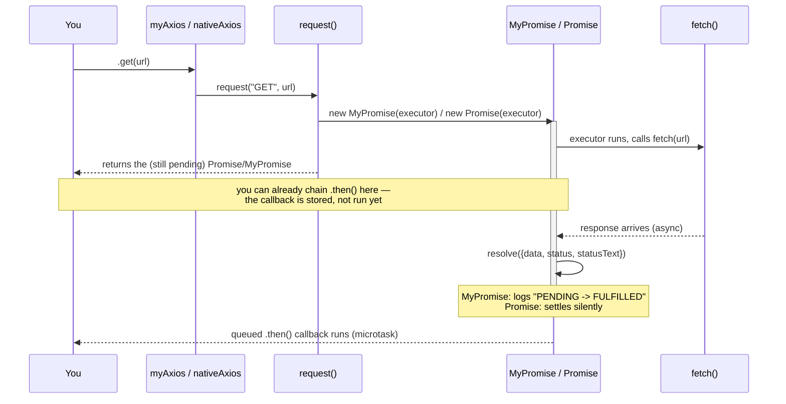

# Theory: What Is Axios (and Everything Around It)

Before touching any code, it helps to know what each of these words actually means and why they exist. This doc is the "vocabulary" layer — [files-overview.md](./files-overview.md) and [flow.md](./flow.md) assume you already know what an HTTP client, a Promise, and `fetch` are.

## 1. What problem does an "HTTP client" solve?

Your JavaScript code often needs to talk to a server over the network — "get me the list of users," "save this note." That conversation happens over **HTTP** (HyperText Transfer Protocol). An **HTTP client** is just: a piece of code whose job is to send that request and hand you back the response, so you don't have to deal with sockets, headers, and raw bytes yourself.

Every tool below — `XMLHttpRequest`, `fetch`, Node's `https` module, Axios — is an HTTP client. They differ in _how low-level_ they are and _how nice_ they are to use.

## 2. What is Axios, really?

Axios is a third-party **JavaScript library** (`npm install axios`) — not part of the language, not built into browsers or Node. Its whole job is to be a nicer wrapper around the lower-level tools:

- In the **browser**, Axios internally uses `XMLHttpRequest` (or `fetch`, in newer versions).
- In **Node.js**, Axios internally uses the built-in `http`/`https` modules.

What Axios adds on top, that raw `fetch`/`https` don't give you for free:

- **Automatic JSON**: `axios.get(url)` gives you `response.data` already parsed — no manual `JSON.parse`/`response.json()`.
- **Rejects on HTTP errors**: a 404 or 500 response makes the returned Promise _reject_, not resolve — unlike raw `fetch`, which only rejects on network failure.
- **Interceptors**: hooks that run before every request / after every response (e.g. "attach an auth token to every outgoing request").
- **Instances with defaults**: `axios.create({ baseURL, headers })` — configure once, reuse everywhere.
- **Request cancellation, timeouts, upload/download progress**, and a consistent API across browser and Node.

None of that is magic — it's all just more code wrapped around the same lower-level HTTP calls you're already making in `http-client.js`. That's exactly what this exercise is: a tiny, honest slice of what Axios actually does internally.

Axios is a popular, promise-based JavaScript library used to make HTTP requests from both the browser and Node.js environments. It simplifies asynchronous communication with web servers and REST APIs, often serving as a cleaner alternative to JavaScript's built-in fetch API. [1] (https://www.youtube.com/watch?v=661GhwA3nYI&t=719), [2] (https://www.youtube.com/watch?v=ec-BR4RyzJs), [3] (https://www.geeksforgeeks.org/html/what-is-axios/), [4] (https://medium.com/free-code-camp/simple-http-requests-in-javascript-using-axios-272e1ac4a916)Key Benefits over fetchAutomatic JSON conversion: It automatically stringifies request bodies and parses JSON responses.Wide browser support: Works smoothly across older browsers without requiring polyfills.Interceptors: Allows you to intercept and modify requests or responses before they are handled.Built-in features: Supports request timeouts, request cancellation, and client-side protection against XSRF. [1] (https://medium.com/@MinimalGhost/what-is-axios-js-and-why-should-i-care-7eb72b111dc0), [2] (https://www.youtube.com/watch?v=ec-BR4RyzJs), [3] (https://medium.com/free-code-camp/simple-http-requests-in-javascript-using-axios-272e1ac4a916)1. InstallationYou can add Axios to your project using a package manager or an HTML script tag:bash# Using npm
npm install axios

# Using yarn

yarn add axios
Use code with caution.Or via CDN inside your HTML <head> or <body>:html<script src="https://cdn.jsdelivr.net/npm/axios/dist/axios.min.js"></script>
Use code with caution.2. Common HTTP Request ExamplesAxios provides convenient methods for all major HTTP verbs. You can handle them using modern async/await syntax or standard .then()/.catch() promises. [1] (https://dev.to/edriso/axios-a-simple-practical-guide-with-examples-2eo8), [2] (https://www.youtube.com/watch?v=KPGn2vlBheA&t=4), [3] (https://www.youtube.com/watch?v=ec-BR4RyzJs)GET Request (Fetching Data)javascriptimport axios from 'axios'; // Not needed if using CDN

async function getUser() {
try {
// Axios automatically parses the response into JSON
const response = await axios.get('https://typicode.com');

    // The actual server response data is located in response.data
    console.log(response.data);
    console.log(response.status); // e.g., 200

} catch (error) {
console.error('Error fetching data:', error.message);
}
}

getUser();
Use code with caution.POST Request (Sending Data)javascriptasync function createUser() {
const newUser = {
name: 'John Doe',
email: 'john@example.com'
};

try {
// Pass the payload object directly as the second argument
const response = await axios.post('https://typicode.com', newUser);
console.log('User created:', response.data);
} catch (error) {
console.error('Error creating user:', error);
}
}

createUser();
Use code with caution.PUT and DELETE Requestsjavascript// PUT: Updating a resource
axios.put('https://typicode.com', { name: 'Jane Doe' })
.then(res => console.log(res.data));

// DELETE: Removing a resource
axios.delete('https://typicode.com')
.then(res => console.log('Deleted successfully'));
Use code with caution.3. Custom ConfigurationsYou can also pass a detailed configuration object to axios() instead of using the shorthand methods:javascriptaxios({
method: 'post',
url: '/user/12345',
baseURL: 'https://example.com',
timeout: 5000, // Aborts request if it takes longer than 5 seconds
headers: { 'X-Requested-With': 'XMLHttpRequest' },
params: {
ID: 12345 // Appends ?ID=12345 to the URL
},
data: {
firstName: 'Fred' // Request body
}
});
Use code with caution.If you want to dive deeper, let me know:Are you setting this up for a frontend framework (like React or Vue) or a Node.js backend?Would you like to see how to implement Interceptors for tasks like adding authorization tokens automatically?

## 3. The four ways to make an HTTP request in JS

| Tool                           | What it is                                                                           | Returns                                                                 | Used in                         |
| ------------------------------ | ------------------------------------------------------------------------------------ | ----------------------------------------------------------------------- | ------------------------------- |
| `XMLHttpRequest` (XHR)         | The original browser API for async requests (from ~2000s AJAX era)                   | Nothing directly — you attach `.onload`/`.onerror` callbacks            | Browser only                    |
| `fetch`                        | Modern browser + Node API, Promise-based from the start                              | A native `Promise`                                                      | Browser (all modern) + Node 18+ |
| `http`/`https` (Node built-in) | Node's low-level networking module — you handle the response as a _stream_ of chunks | Nothing directly — you attach `.on("data")`/`.on("end")` callbacks      | Node only                       |
| Axios                          | Third-party library wrapping XHR/`fetch`/`https`                                     | A Promise, with `.data` already parsed and error status codes rejecting | Browser + Node                  |

Where the files in this exercise sit on that table:

- `http-client.js` / `native-http-client.js` use **`fetch`** — closest to what modern Axios does under the hood in a browser, and the simplest to read.
- The `https`-module snippet from your `reference.md` (see the earlier conversation) is the **Node `https`** row — lower-level, manual chunk handling, closer to what Axios does under the hood when running in Node.
- `myAxios` / `nativeAxios` are _your_ tiny Axios — same idea as real Axios, much smaller.

## 4. What is a Promise, in one paragraph

A `Promise` is a container for "a value that isn't ready yet, but will be — or will fail." It starts `pending`, and settles exactly once, either `fulfilled` (with a value) or `rejected` (with a reason). `.then()` lets you register what happens once it settles, without blocking the rest of your code while you wait. Every HTTP client above either returns a Promise directly (`fetch`, Axios) or requires you to build one yourself around callbacks (`XMLHttpRequest`, `https`) — which is exactly what `http-client.js` and `native-http-client.js` do. For the full mechanics of _how_ a Promise is implemented — state machine, chaining, microtasks — see [custom-promise.md](./custom-promise.md).

## 5. HTTP vocabulary you'll keep seeing

- **Method** — what kind of operation: `GET` (read), `POST` (create), `PUT`/`PATCH` (update), `DELETE` (remove).
- **URL / endpoint** — the address of the resource, e.g. `https://jsonplaceholder.typicode.com/todos/1`.
- **Headers** — metadata about the request/response, e.g. `Content-Type: application/json` tells the server "the body is JSON."
- **Body** — the actual data being sent (for `POST`/`PUT`/`PATCH`) or received.
- **Status code** — a 3-digit number summarizing what happened: `200` OK, `201` Created, `404` Not Found, `500` Server Error. Codes `200-299` mean success; that's exactly the `response.ok` / `status >= 200 && status < 300` check you see in `http-client.js`.
- **JSON** (JavaScript Object Notation) — the text format almost every API uses to send structured data. `JSON.stringify()` turns a JS object into that text; `JSON.parse()` turns it back.

## 6. Where this exercise fits in the real world

You will basically never need to write your own Axios in a real project — you'd `npm install axios` and move on. The value of this exercise isn't the library you end up with; it's that once you've built the pieces by hand (Promise state machine, wrapping a raw async API, exposing a friendly `.get`/`.post` surface), reading _real_ Axios's behavior — or debugging why a request didn't reject the way you expected — stops being a mystery. You'll recognize every piece, because you built a smaller version of it yourself.

`https.get()` returns an **`http.ClientRequest` object**.

In your code:

```js
const request = https.get(url, (res) => {
  // ...
});
```

So:

```text
https.get()
    ↓
ClientRequest object
```

### But what is `res`?

The callback:

```js
https.get(url, (res) => {
  // res
});
```

receives the **server's response**, which is an `IncomingMessage` object.

So there are **two different things**:

```text
https.get(url, callback)
      │
      ├── returns → ClientRequest
      │
      └── callback receives → IncomingMessage (res)
```

### In your code

```js
https.get(url, (res) => {
  console.log(res.statusCode);
});
```

`res` is **not what `https.get()` returns**.

`res` is passed **into your callback when the server responds**.

For example:

```js
const request = https.get(url, (res) => {
  console.log("Response:", res);
});

console.log("Request:", request);
```

Think:

- **`request`** → the request you're sending
- **`res`** → the response you're receiving

And `res` gives you things like:

```js
res.statusCode
res.headers
res.on("data", ...)
res.on("end", ...)
```

That's why your earlier code uses:

```js
res.on("data", ...)
```

to receive the response body.

# Building Your Own Axios on Top of Your Own Promise

Everything lives in one folder: [`js-run/promise/custom-promise/`](../../../../js-run/promise/custom-promise/):

- `custompromise.js` — your own `MyPromise` class. This is the **only** Promise implementation in this exercise; nothing else defines a second one.
- `http-client.js` — one `request(method, url, body)` function that wraps `fetch` in your `MyPromise` (`require("./custompromise")`)
- `my-axios.js` — the friendly `myAxios.get/post/put/patch/delete` API, built on `http-client.js`
- `native-http-client.js` / `native-axios.js` — the exact same client, but built on the real, built-in `Promise` instead — for comparison only
- `demo.js` — runnable example (`node demo.js`)
- `demo-compare.js` — runs both `myAxios` and `nativeAxios` against the same URL so you can see them side by side (`node demo-compare.js`)

`custompromise.js` used to live one folder up (`js-run/promise/custompromise.js`) as a standalone exercise, and an earlier draft of this Axios exercise had a second, separate Promise class next to it. Both problems are fixed now: there's exactly one `MyPromise`, and it lives right next to the code that uses it. Its `.then()`/`.catch()`/`.finally()` were rewritten in place to fix a real chaining bug (see §1 and §3 below) — the state fields, `_promiseResolver`/`_promiseRejector` naming, and the four numbered examples at the bottom are all still yours, unchanged.

New to this exercise? Start with [`theory.md`](./theory.md) (what Axios/`fetch`/Promises even are), then [`files-overview.md`](./files-overview.md) (what each file is) and [`flow.md`](./flow.md) (a step-by-step flowchart) before this doc — this one is the "why," those are the vocabulary, "what," and "how."

The goal isn't "learn Axios's source code." It's: **an HTTP client is just a function that returns a Promise.** Once you have your own Promise class, you can plug it into anything async — `fetch`, `XMLHttpRequest`, `setTimeout` — and it behaves the same way the real thing does.

## 1. Why `.then()` needs to return a _new_ Promise

A naive Promise stores one value and runs callbacks on it. That breaks chaining:

```js
promise.then((v) => v + 1).then((v) => console.log(v));
```

For the second `.then()` to receive `v + 1`, the first `.then()` can't just return the original promise — it has to return a **new** promise that resolves with whatever the first callback returns. That's the one idea that separates a "toy" Promise from a working one.

```js
then(onFulfilled, onRejected) {
  return new MyPromise((resolve, reject) => {
    // run onFulfilled/onRejected, then resolve() the *new* promise
    // with whatever they return
  });
}
```

See `then()` in `custompromise.js` — every call builds a fresh `MyPromise` around the result of your callback.

## 2. Why the callback runs on `queueMicrotask`

Real Promises never call your `.then()` callback synchronously — even if the promise is already settled:

```js
Promise.resolve(1).then((v) => console.log(v));
console.log("first");
// logs "first" then "1"
```

If your `MyPromise` ran callbacks immediately, code order would depend on _when_ you happened to resolve, which is confusing and inconsistent with the real `Promise`. `queueMicrotask` defers the callback to the microtask queue, matching native behavior.

## 3. Handling a returned `MyPromise` (chaining across async steps)

If a `.then()` callback returns another `MyPromise` (e.g. you kick off a second request), the outer promise must wait for the inner one instead of resolving with "a promise object". This is `_promiseResolver` in `custompromise.js`:

```js
_promiseResolver(value) {
  if (this._state !== PromiseState.PENDING) return;

  if (value instanceof MyPromise) {
    value.then(this._promiseResolver.bind(this), this._promiseRejector.bind(this));
    return; // adopt the inner promise's outcome instead of settling now
  }

  this._state = PromiseState.FULFILLED;
  // ...settle normally
}
```

This is what makes this valid:

```js
myAxios.get("/a").then((res) => myAxios.post("/b", res.data));
```

Note: this only unwraps `MyPromise` instances, not arbitrary "thenables." Real `Promise` handles any object with a `.then` method — that generality is left out here on purpose to keep the class readable.

## 4. `.catch()` and `.finally()` are just `.then()` in disguise

```js
catch(onRejected) {
  return this.then(undefined, onRejected);
}

finally(onFinally) {
  return this.then(
    (value) => { onFinally(); return value; },
    (reason) => { onFinally(); throw reason; },
  );
}
```

No new state machine needed — both are written in terms of `then()`, exactly like the spec describes real Promises.

## 5. Wrapping `fetch` instead of a raw callback

`fetch` already returns a native `Promise`. The HTTP client's job is only to **translate** that into a `MyPromise` and normalize the shape of the result, same as Axios does:

```js
function request(method, url, body) {
  return new MyPromise((resolve, reject) => {
    fetch(url, { method, headers: {...}, body: JSON.stringify(body) })
      .then(async (response) => {
        const data = await response.json();
        if (!response.ok) return reject(new Error(...));
        resolve({ data, status: response.status, statusText: response.statusText });
      })
      .catch(reject);
  });
}
```

`fetch` doesn't reject on HTTP error codes (404, 500, …) — only on network failure — so the `!response.ok` check is what turns "request completed but failed" into a rejection, matching how Axios behaves.

> In a browser, you'd typically reach for `XMLHttpRequest` instead of `fetch` (that's what the Full Stack Open course material and older Axios internals use). The wrapping pattern is identical — only the thing inside `new MyPromise(...)` changes:
>
> ```js
> return new MyPromise((resolve, reject) => {
>   const xhr = new XMLHttpRequest();
>   xhr.open(method, url, true);
>   xhr.onload = () => (xhr.status < 300 ? resolve(...) : reject(...));
>   xhr.onerror = () => reject(new Error("Network request failed"));
>   xhr.send(body ? JSON.stringify(body) : undefined);
> });
> ```

## 6. The friendly API layer

`myAxios` is nothing but named shortcuts over `request()`:

```js
const myAxios = {
  get: (url) => request("GET", url),
  post: (url, data) => request("POST", url, data),
  // ...
};
```

This is the whole point of building the library: callers never see `MyPromise`, `fetch`, or HTTP verbs as strings — they just write `myAxios.get(url).then(...)`, same as real Axios.

## 7. Watching the state transitions

`MyPromise` starts every instance as `PromiseState.PENDING` and can only move to `FULFILLED` or `REJECTED` once (the `if (this._state !== PromiseState.PENDING) return;` guard in `_promiseResolver`/`_promiseRejector` enforces that — this is the exact bug fix from your `reference.md` §21: a settled promise must never change state again). Both log the transition:

```js
_promiseResolver(value) {
  if (this._state !== PromiseState.PENDING) return;
  // ...
  this._state = PromiseState.FULFILLED;
  this._value = value;
  console.log("MyPromise: PENDING -> FULFILLED", value);
  this._successCallbackHandlers.forEach((callback) => callback(value));
}
```

Because every `.then()`/`.catch()`/`.finally()` call internally creates a **new** `MyPromise` (see §1), a single chain logs one transition per link — that's expected, not a bug. Run `node demo.js` and count the `MyPromise: PENDING -> FULFILLED` lines against the number of `.then()`/`.catch()`/`.finally()` calls in the chain.

Native `Promise` doesn't expose its internal state at all — `console.log(somePromise)` just prints `Promise { <pending> }` or `Promise { value }`. That's the tradeoff of building your own: you get visibility into the state machine that the built-in one hides from you.

## 8. Custom Promise vs. built-in Promise, side by side

`native-http-client.js` and `native-axios.js` are line-for-line the same as `http-client.js`/`my-axios.js` — only `new MyPromise(...)` becomes `new Promise(...)`. That's the whole point: your class is a drop-in replacement with the same shape (`then`/`catch`/`finally`, executor takes `resolve`/`reject`).

```js
const myAxios = require("./my-axios"); // returns MyPromise (from ./custompromise.js)
const nativeAxios = require("./native-axios"); // returns Promise

console.log(nativeAxios.get(url)); // Promise { <pending> }
console.log(myAxios.get(url)); // MyPromise { _state: 'pending', _value: undefined, ... }
```

Run the comparison:

```bash
node js-run/promise/custom-promise/demo-compare.js
```

You'll see:

- `nativeAxios.get(url)` immediately prints `Promise { <pending> }` — Node shows you it's pending but nothing about _how_ it got there.
- `myAxios.get(url)` immediately prints the full `MyPromise` object (`_state: 'pending'`, empty callback arrays) — then, once `fetch` resolves, the `console.log` inside `_promiseResolver()` fires and shows `PENDING -> FULFILLED` with the settled value.
- Both eventually log the identical `response.data` from the same URL — proving the two implementations are behaviorally equivalent, even though one is hand-written and one is native.

## Mental model, end to end

```text
myAxios.post(url, data)
      │
      ▼
request("POST", url, data)
      │
      ▼
new MyPromise((resolve, reject) => { fetch(...) })   ← executor runs immediately
      │
      ▼
fetch resolves/rejects (native Promise, async)
      │
      ▼
your resolve()/reject() settles the MyPromise
      │
      ▼
queued .then() callbacks run on the microtask queue
      │
      ▼
each .then() returns a *new* MyPromise, so chaining keeps working
```

## Try it

```bash
node js-run/promise/custom-promise/demo.js
```

It chains a `GET` into a `POST`, and exercises `.catch()`/`.finally()` — same flow real Axios code would follow, just powered by `MyPromise` instead of the built-in `Promise`. Watch the `MyPromise: PENDING -> FULFILLED/REJECTED` lines interleave with your own `console.log`s to see exactly when each promise in the chain settles.

Then compare against the built-in `Promise`:

```bash
node js-run/promise/custom-promise/demo-compare.js
```

# File Map: What Each File Actually Is

7 files, one folder ([`js-run/promise/custom-promise/`](../../../../js-run/promise/custom-promise/)), but really only **3 ideas**, each duplicated once for comparison:

```text
1. the Promise engine  →  custompromise.js
2. the HTTP client     →  http-client.js        (uses #1)
                          native-http-client.js  (uses built-in Promise instead)
3. the friendly API    →  my-axios.js            (uses http-client.js)
                          native-axios.js        (uses native-http-client.js)
4. things you run      →  demo.js
                          demo-compare.js
```

If you only read one file to understand "my own Promise," read **`custompromise.js`**. Everything else is just "now use it for something real" (an HTTP client) and "now prove it behaves like the real thing" (the `native-*` twins).

There are 4 docs total, read in this order:

1. **[`theory.md`](./theory.md)** — vocabulary first: what Axios/`fetch`/XHR/Promises actually are, before any of this code makes sense.
2. **`files-overview.md`** (this file) — what each file is and why it exists.
3. **[`flow.md`](./flow.md)** — a flowchart of what actually happens, step by step, comparing the native `Promise` path and the `MyPromise` path side by side.
4. **[`custom-promise.md`](./custom-promise.md)** — the deep dive into _why_ each line of `custompromise.js` is written the way it is.

---

## `custompromise.js` — the engine, yours

This is the only Promise implementation in the whole exercise. Everything else depends on it.

- Defines the `MyPromise` class: `PENDING → FULFILLED/REJECTED`, `.then()`, `.catch()`, `.finally()`.
- Has **no idea what HTTP is**. It knows nothing about `fetch`, URLs, or Axios. It's a general-purpose async container, same as the real `Promise`.
- `console.log`s every state change (`PENDING -> FULFILLED` / `PENDING -> REJECTED`) so you can watch it work.
- The four numbered usage examples at the bottom are the same ones you originally wrote — they only run when you execute this file directly (`node custompromise.js`), not when another file `require`s it (that's the `if (require.main === module)` guard).

Depends on: nothing.

---

## `http-client.js` — teaching `MyPromise` how to make a request

- One function: `request(method, url, body)`.
- Its only job: call `fetch(...)`, and instead of returning `fetch`'s own native Promise, wrap the result in `new MyPromise(...)` (`require("./custompromise")`).
- Knows nothing about `.get`/`.post` — just "make this one HTTP call and settle a `MyPromise` with the result."

Depends on: `custompromise.js`.

---

## `my-axios.js` — the nice API you actually call

- `myAxios.get(url)`, `myAxios.post(url, data)`, etc.
- Each method is a one-line shortcut that calls `request(method, url, body)` from `http-client.js` with the right verb filled in.
- This is the file whose _shape_ imitates real Axios (`axios.get(...)`, `axios.post(...)`).

Depends on: `http-client.js` → `custompromise.js`.

---

## `native-http-client.js` and `native-axios.js` — the control group

- **Identical** to `http-client.js` / `my-axios.js`, except `new MyPromise(...)` is swapped for `new Promise(...)` (the real, built-in one).
- They exist for exactly one reason: so you can run the same request through your class and through the real class, and see the results match.
- You don't need these to have a working Axios clone — they're purely for comparison/proof, not part of the "product."

Depends on: nothing but the built-in `Promise`.

---

## `demo.js` — the actual usage example

- Requires only `my-axios.js`.
- Chains a `GET` into a `POST` using `.then()`, and exercises `.catch()`/`.finally()`.
- This is "here's what using your library looks like in real code." Run it with `node demo.js`.

---

## `demo-compare.js` — side-by-side proof

- Requires both `my-axios.js` (labeled CUSTOM in the file) and `native-axios.js` (labeled INBUILT).
- Fires the same `GET` request through both, logs what each one returns, and shows they produce the same data.
- This is the file that answers "does my Promise actually behave like the real one?" Run it with `node demo-compare.js`.

---

## If you're still confused, start here

Ignore every file except these two, in this order:

1. **`custompromise.js`** — read `then()` first, it's the heart of the whole thing.
2. **`demo.js`** — run it, then read it top to bottom. It's 15 lines and uses everything else indirectly.

Everything else (`http-client.js`, `my-axios.js`, the `native-*` files, `demo-compare.js`) is plumbing and proof, not new concepts. The deep explanation of _why_ each piece of `custompromise.js` is written the way it is lives in [custom-promise.md](./custom-promise.md).

# Request Flow: Native `Promise` vs `MyPromise`

One picture, two runs. `nativeAxios.get(url)` and `myAxios.get(url)` do the exact same job — the only thing that changes is which box does the settling.

## The one line that decides everything

```text
native-http-client.js:  return new Promise((resolve, reject) => { fetch(url)...  })
http-client.js:         return new MyPromise((resolve, reject) => { fetch(url)... })
```

Same `fetch` call. Same `resolve`/`reject` calls. Only the container is different — and that container is the only thing this whole exercise built from scratch.

## Where the two paths split and rejoin

```text
you call
  nativeAxios.get(url)              myAxios.get(url)
        │                                 │
        ▼                                 ▼
  native-axios.js                    my-axios.js
        │                                 │
        ▼                                 ▼
  native-http-client.js              http-client.js
   request("GET", url)                request("GET", url)
        │                                 │
        ▼                                 ▼
  new Promise(executor)              new MyPromise(executor)
   [built into Node/V8]               [custompromise.js — yours]
        │                                 │
        └────────────┬────────────────────┘
                      ▼
              executor runs immediately (synchronously)
                      │
                      ▼
              fetch(url, { method, headers, body })
                      │
              (this ALWAYS returns a native Promise —
               even inside your MyPromise executor)
                      │
              ... network round trip, async, takes time ...
                      │
                      ▼
              response arrives, fetch's own Promise settles
                      │
              your executor's .then(async response => {...}) runs
                      │
              parses JSON, checks response.ok
                      │
        ┌─────────────┴─────────────┐
        ▼                                 ▼
  resolve({data,status,...})        resolve({data,status,...})
   or reject(new Error(...))         or reject(new Error(...))
        │                                 │
        ▼                                 ▼
  V8 settles the Promise             _promiseResolver/_promiseRejector runs
  internally (hidden from you)       in custompromise.js
        │                                 │
        │                            state: pending -> fulfilled/rejected
        │                            console.log("MyPromise: PENDING -> ...")
        │                                 │
        ▼                                 ▼
  queued .then() reactions run on the microtask queue (both paths, same idea)
        │                                 │
        ▼                                 ▼
  your .then(response => {...}) callback finally runs, with `response.data`
```

## Side by side

| Step                                              | Native `Promise` (`nativeAxios`)                         | `MyPromise` (`myAxios`)                                             |
| ------------------------------------------------- | -------------------------------------------------------- | ------------------------------------------------------------------- |
| Container created by                              | V8 (built into Node)                                     | `custompromise.js` — code you wrote                                 |
| `console.log(promise)` shows                      | `Promise { <pending> }` — state is hidden                | `MyPromise { _state: 'pending', ... }` — every field visible        |
| State transition visible?                         | No                                                       | Yes — logs `PENDING -> FULFILLED`/`REJECTED`                        |
| `.then()` callback timing                         | Deferred to the microtask queue (native)                 | Deferred to the microtask queue (`queueMicrotask`, written by hand) |
| Chaining (`return` value flows to next `.then()`) | Built in                                                 | Built by hand — `.then()` returns a _new_ `MyPromise`               |
| Returning a promise from `.then()`                | Native "thenable" resolution (any `.then`-shaped object) | Only unwraps `instanceof MyPromise` — narrower, on purpose          |
| What actually talks to the network                | `fetch` (native, always returns a real `Promise`)        | Same `fetch` call — `MyPromise` never touches the network itself    |

The last row is the important one: **your `MyPromise` never does networking.** It only wraps the result of a real `fetch` call. That's true of real Axios too — Axios doesn't reinvent HTTP, it wraps `XMLHttpRequest`/`fetch` in a nicer Promise-based API. Same trick, smaller scale.

## Sequence view



## Try it yourself

```bash
node js-run/promise/custom-promise/demo-compare.js
```

Watch the order of output: `nativeAxios.get()` prints `Promise { <pending> }` instantly and gives no further hint about its internals. `myAxios.get()` prints the full `_state: 'pending'` object, then — once `fetch` resolves — the `MyPromise: PENDING -> FULFILLED` log line appears _before_ your own `.then()` callback's `console.log`, because settling the promise and running its callback are two separate steps (see the diagram above).
